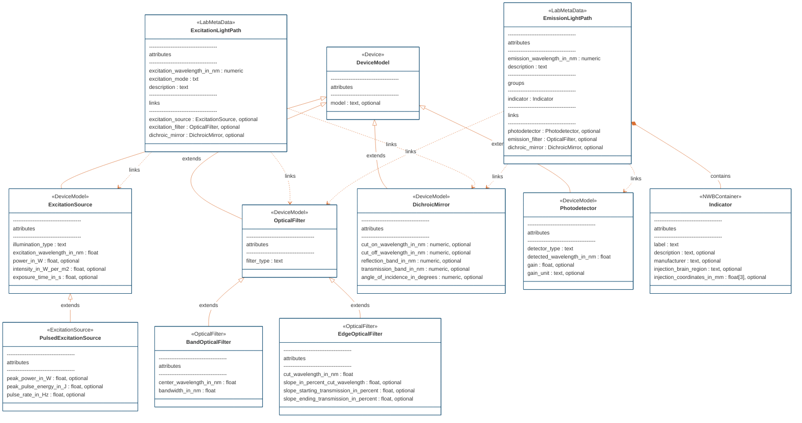

# ndx-microscopy Extension for NWB

A Neurodata Without Borders (NWB) extension for storing microscopy data and associated metadata in a standardized format. This extension integrates with [ndx-ophys-devices](https://github.com/catalystneuro/ndx-ophys-devices) to provide comprehensive optical component specifications.

## Features

- **Comprehensive Data Types**
  - Microscope and optical component metadata
  - Advanced light path configurations
  - Imaging space definitions
  - Time series data with variable depth support
  - ROI/segmentation storage

- **Multiple Modalities**
  - One-photon microscopy (widefield)
  - Two-photon microscopy
  - Three-photon microscopy
  - Light sheet microscopy

- **Flexible Organization**
  - Support for 2D and 3D imaging
  - Multi-channel data handling
  - Variable depth imaging
  - Coordinate system management

## Installation

```bash
pip install ndx-microscopy
```
## Basic Usage

```python
from datetime import datetime
from uuid import uuid4
from pynwb import NWBFile, NWBHDF5IO
from ndx_microscopy import Microscope, ExcitationLightPath, EmissionLightPath
from ndx_ophys_devices import Indicator

# Create NWB file
nwbfile = NWBFile(
    session_description='Two-photon calcium imaging session',
    identifier=str(uuid4()),
    session_start_time=datetime.now()
)

# Set up microscope
microscope = Microscope(
    name='2p-scope',
    model='Custom two-photon microscope'
)
nwbfile.add_device(microscope)

# Create indicator
indicator = Indicator(
    name='gcamp6f',
    label='GCaMP6f',
    description='Calcium indicator'
)

# Configure light paths
excitation = ExcitationLightPath(
    name='2p_excitation',
    excitation_wavelength_in_nm=920.0,
    excitation_mode='two-photon'
)
nwbfile.add_lab_meta_data(excitation)


emission = EmissionLightPath(
    name='gcamp_emission',
    emission_wavelength_in_nm=510.0,
    indicator=indicator
)
nwbfile.add_lab_meta_data(emission)

# Define imaging space
imaging_space = PlanarImagingSpace(
    name='cortex_plane1',
    description='Layer 2/3 of visual cortex',
    grid_spacing_in_um=[1.0, 1.0],
    origin_coordinates=[100.0, 200.0, 300.0]
)

# Create microscopy series
imaging_series = PlanarMicroscopySeries(
    name='imaging_data',
    microscope=microscope,
    excitation_light_path=excitation,
    emission_light_path=emission,
    imaging_space=imaging_space,
    data=data_array,  # Your imaging data array
    unit='n.a.',
    rate=30.0
)

# Add to file
nwbfile.add_acquisition(imaging_series)

# Save file
with NWBHDF5IO('calcium_imaging.nwb', 'w') as io:
    io.write(nwbfile)
```

## Entity relationship diagram

#### Entity relationship diagram for ndx-ophys-devices objects in ndx-microscopy 



#### Entity relationship diagram for ndx-microscopy 


---
This extension was created using [ndx-template](https://github.com/nwb-extensions/ndx-template).


## Documentation

For detailed documentation, including API reference and additional examples, please visit our [documentation site](https://ndx-microscopy.readthedocs.io/).

The documentation includes:
- Getting Started Guide
- User Guide with Best Practices
- Comprehensive Examples
- Complete API Reference
- Data Format Specifications

## Contributing

To help ensure a smooth Pull Request (PR) process, please always begin by raising an issue on the main repository so we can openly discuss any problems/additions before taking action.

The main branch of ndx-microscopy is protected; you cannot push to it directly. You must upload your changes by pushing a new branch, then submit your changes to the main branch via a Pull Request. This allows us to conduct automated testing of your contribution, and gives us a space for developers to discuss the contribution and request changes. If you decide to tackle an issue, please make yourself an assignee on the issue to communicate this to the team. Don’t worry - this does not commit you to solving this issue. It just lets others know who they should talk to about it.

From your local copy directory, use the following commands.

If you have not already, you will need to clone the repo:
```bash
$ git clone https://github.com/catalystneuro/neuroconv
```

First create a new branch to work on
```bash
$ git checkout -b <new_branch>
```

Make your changes. Add new objects related to optical experiment or add more attributes on the existing ones. To speed up the process, you can write mock function (see _mock.py) that would be used to test the new neurodata type

We will automatically run tests to ensure that your contributions didn’t break anything and that they follow our style guide. You can speed up the testing cycle by running these tests locally on your own computer by calling pytest from the top-level directory.
Push your feature branch to origin (i.e. GitHub)

```bash
$ git push origin <new_branch>
```

Once you have tested and finalized your changes, create a pull request (PR) targeting dev as the base branch:
Ensure the PR description clearly describes the problem and solution.
Include the relevant issue number if applicable. TIP: Writing e.g. “fix #613” will automatically close issue #613 when this PR is merged.
Before submitting, please ensure that the code follows the standard coding style of the respective repository.
If you would like help with your contribution, or would like to communicate contributions that are not ready to merge, submit a PR where the title begins with “[WIP].”

Update the CHANGELOG.md regularly to document changes to the extension.

## License

MIT License. See [LICENSE.txt](LICENSE.txt) for details.
