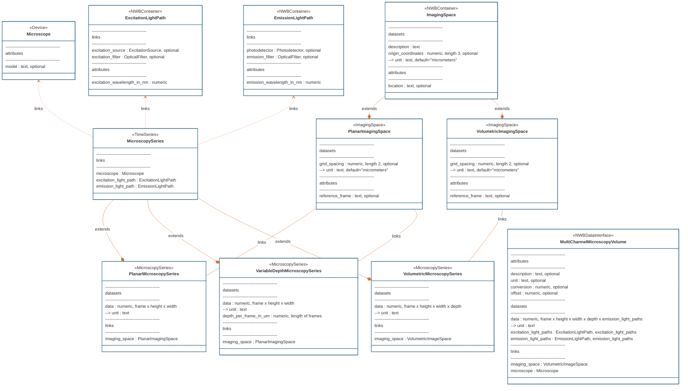

# ndx-microscopy Extension for NWB

An enhancement to core NWB schema types related to microscopy data.

Planned for an eventual NWBEP with the TAB.


## Installation

```
git clone https://github.com/catalystneuro/ndx-microscopy
pip install ndx-microscopy
```


## Usage

```python
# TODO
```


## Entity relationship diagram



---
This extension was created using [ndx-template](https://github.com/nwb-extensions/ndx-template).
