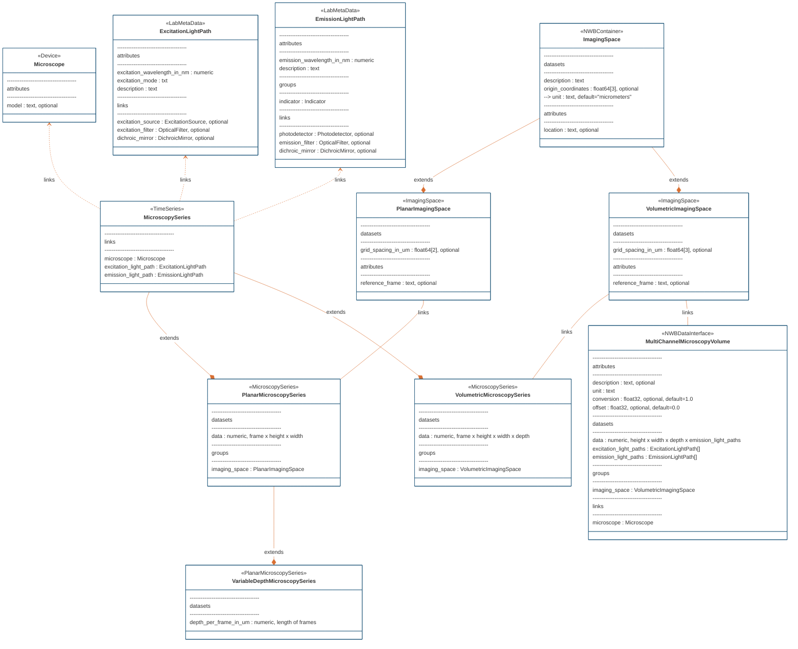

# ndx-microscopy Extension for NWB

This is an NWB extension for storing microscopy data and associated metadata in a standardized format. This extension integrates with [ndx-ophys-devices](https://github.com/catalystneuro/ndx-ophys-devices) to provide comprehensive optical component specifications for microscopy setups.

## Overview

The ndx-microscopy extension provides a comprehensive framework for storing and organizing microscopy data within the Neurodata Without Borders (NWB) ecosystem. It supports various microscopy techniques including:

- One-photon microscopy (widefield)
- Two-photon microscopy
- Three-photon microscopy
- Light sheet microscopy

The extension introduces several new neurodata types to handle different aspects of microscopy data:

- **Microscope** (extends Device): Metadata about the microscope device

- **Light Paths**:
  * **ExcitationLightPath** (extends LabMetaData): Excitation light path with wavelength, mode, and optional components (source, filter, mirror)
  * **EmissionLightPath** (extends LabMetaData): Emission light path with wavelength, required indicator, and optional components (detector, filter, mirror)

- **Imaging Spaces**:
  * **ImagingSpace** (extends NWBContainer): Base type with description, coordinates, and location
  * **PlanarImagingSpace** (extends ImagingSpace): 2D imaging space with grid spacing
  * **VolumetricImagingSpace** (extends ImagingSpace): 3D imaging space with volumetric grid spacing

- **Microscopy Series**:
  * **MicroscopySeries** (extends TimeSeries): Base type for microscopy time series
  * **PlanarMicroscopySeries** (extends MicroscopySeries): 2D time series data
  * **VariableDepthMicroscopySeries** (extends PlanarMicroscopySeries): 2D series with variable depth
  * **VolumetricMicroscopySeries** (extends MicroscopySeries): 3D time series data

- **Segmentation**:
  * **MicroscopySegmentations** (extends NWBDataInterface): Container for segmentation data
  * **MicroscopyPlaneSegmentation** (extends DynamicTable): Detailed segmentation with image masks, pixel masks, and voxel masks

- **Multi-Channel Volumes**:
  * **MultiChannelMicroscopyVolume** (extends NWBDataInterface): Static volumetric data with multiple channels
  * **VariableDepthMultiChannelMicroscopyVolume** (extends NWBDataInterface): Multi-channel volume with irregular depth spacing

- **Response Data**:
  * **MicroscopyResponseSeries** (extends TimeSeries): ROI response time series
  * **MicroscopyResponseSeriesContainer** (extends NWBDataInterface): Container for multiple response series

#### Entity relationship diagram for ndx-ophys-devices objects in ndx-microscopy 


#### Entity relationship diagram for ndx-microscopy 




## Installation

```bash
pip install ndx-microscopy
```

For MATLAB users:
```matlab
generateExtension('<directory path>/ndx-microscopy/spec/ndx-microscopy.namespace.yaml');
```

## Usage Examples

### Simple Implementation

#### Two-photon Calcium Imaging

```python
from datetime import datetime
from uuid import uuid4
from pynwb import NWBFile, NWBHDF5IO
from ndx_microscopy import (
    Microscope, 
    ExcitationLightPath,
    EmissionLightPath,
    PlanarImagingSpace,
    PlanarMicroscopySeries
)
from ndx_ophys_devices import Indicator

# Create NWB file
nwbfile = NWBFile(
    session_description='Two-photon calcium imaging session',
    identifier=str(uuid4()),
    session_start_time=datetime.now()
)

# Set up microscope
microscope = Microscope(
    name='2p-scope',
    model='Custom two-photon microscope',
    description='Two-photon microscope for calcium imaging',
    manufacturer='Custom build'
)
nwbfile.add_device(microscope)

# Create indicator
indicator = Indicator(
    name='gcamp6f',
    label='GCaMP6f',
    description='Calcium indicator',
    manufacturer='Addgene'
)

# Configure light paths
excitation = ExcitationLightPath(
    name='2p_excitation',
    excitation_wavelength_in_nm=920.0,
    excitation_mode='two-photon',
    description='Femtosecond pulsed laser'
)
nwbfile.add_lab_meta_data(excitation)

emission = EmissionLightPath(
    name='gcamp_emission',
    emission_wavelength_in_nm=510.0,
    description='GCaMP6f emission path',
    indicator=indicator
)
nwbfile.add_lab_meta_data(emission)

# Define imaging space
imaging_space = PlanarImagingSpace(
    name='cortex_plane1',
    description='Layer 2/3 of visual cortex',
    grid_spacing_in_um=(1.0, 1.0),  # x, y spacing
    origin_coordinates=(100.0, 200.0, 300.0),  # x, y, z coordinates
    location='Visual cortex, layer 2/3',
    reference_frame='Bregma'
)

# Create microscopy series
imaging_series = PlanarMicroscopySeries(
    name='imaging_data',
    microscope=microscope,
    excitation_light_path=excitation,
    emission_light_path=emission,
    imaging_space=imaging_space,
    data=data_array,  # Your imaging data array
    unit='n.a.',
    conversion=1.0,
    offset=0.0,
    rate=30.0,
    starting_time=0.0
)

# Add to file
nwbfile.add_acquisition(imaging_series)

# Save file
with NWBHDF5IO('calcium_imaging.nwb', 'w') as io:
    io.write(nwbfile)
```

#### One-photon (Widefield) Imaging

```python
# Create indicator
indicator = Indicator(
    name='gcamp6f',
    label='GCaMP6f',
    description='Calcium indicator',
    manufacturer='Addgene'
)

# Configure light paths for one-photon imaging
excitation = ExcitationLightPath(
    name='1p_excitation',
    excitation_wavelength_in_nm=480.0,
    excitation_mode='one-photon',
    description='LED illumination'
)
nwbfile.add_lab_meta_data(excitation)

emission = EmissionLightPath(
    name='gcamp_emission',
    emission_wavelength_in_nm=510.0,
    description='GCaMP6f emission path',
    indicator=indicator
)
nwbfile.add_lab_meta_data(emission)

# Rest of the setup follows the same pattern as two-photon example
```

### Detailed Implementation with Optical Components

#### Two-photon Calcium Imaging with Full Optical Path

```python
from datetime import datetime
from uuid import uuid4
from pynwb import NWBFile, NWBHDF5IO
from ndx_microscopy import (
    Microscope, 
    ExcitationLightPath,
    EmissionLightPath,
    PlanarImagingSpace,
    PlanarMicroscopySeries
)
from ndx_ophys_devices import (
    ExcitationSource,
    OpticalFilter,
    DichroicMirror,
    Photodetector
)

# Create NWB file
nwbfile = NWBFile(
    session_description='Two-photon calcium imaging session',
    identifier=str(uuid4()),
    session_start_time=datetime.now()
)

# Set up microscope
microscope = Microscope(
    name='2p-scope',
    model='Custom two-photon microscope'
)
nwbfile.add_device(microscope)

# Set up optical components
laser = PulsedExcitationSource(
    name='chameleon',
    illumination_type='Laser',
    manufacturer='Coherent',
    model='Chameleon Ultra II',
    excitation_wavelength_in_nm=920.0,
    power_in_W=1.2,  # 1200 mW
    peak_power_in_W=100e3,  # 100 kW peak power
    peak_pulse_energy_in_J=1.25e-9,  # 1.25 nJ
    pulse_rate_in_Hz=80e6  # 80 MHz
)
nwbfile.add_device(laser)

excitation_filter = BandOpticalFilter(
    name='excitation_filter',
    filter_type='Bandpass',
    manufacturer='Semrock',
    model='FF01-920/80',
    center_wavelength_in_nm=920.0,
    bandwidth_in_nm=80.0
)
nwbfile.add_device(excitation_filter)

dichroic = DichroicMirror(
    name='primary_dichroic',
    manufacturer='Semrock',
    model='FF695-Di02',
    center_wavelength_in_nm=695.0
)
nwbfile.add_device(dichroic)

emission_filter = BandOpticalFilter(
    name='emission_filter',
    filter_type='Bandpass',
    manufacturer='Semrock',
    model='FF01-510/84',
    center_wavelength_in_nm=510.0,
    bandwidth_in_nm=84.0
)
nwbfile.add_device(emission_filter)

detector = Photodetector(
    name='pmt',
    detector_type='PMT',
    manufacturer='Hamamatsu',
    model='R6357',
    detected_wavelength_in_nm=510.0,
    gain=70.0,
    gain_unit='dB'
)
nwbfile.add_device(detector)

# Create indicator
indicator = Indicator(
    name='gcamp6f',
    label='GCaMP6f',
    description='Calcium indicator for two-photon imaging',
    manufacturer='Addgene',
    injection_brain_region='Visual cortex',
    injection_coordinates_in_mm=[-2.5, 3.2, 0.5]  # Example coordinates
)

# Configure light paths with optical components
excitation = ExcitationLightPath(
    name='2p_excitation',
    excitation_wavelength_in_nm=920.0,
    excitation_mode='two-photon',
    description='Femtosecond pulsed laser pathway',
    excitation_source=laser,
    excitation_filter=excitation_filter,
    dichroic_mirror=dichroic
)
nwbfile.add_lab_meta_data(excitation)

emission = EmissionLightPath(
    name='gcamp_emission',
    emission_wavelength_in_nm=510.0,
    description='GCaMP6f emission pathway',
    indicator=indicator,
    photodetector=detector,
    emission_filter=emission_filter,
    dichroic_mirror=dichroic
)
nwbfile.add_lab_meta_data(emission)

# Define imaging space
imaging_space = PlanarImagingSpace(
    name='cortex_plane1',
    description='Layer 2/3 of visual cortex',
    grid_spacing_in_um=[1.0, 1.0],
    origin_coordinates=[100.0, 200.0, 300.0]
)

# Create microscopy series
imaging_series = PlanarMicroscopySeries(
    name='imaging_data',
    microscope=microscope,
    excitation_light_path=excitation,
    emission_light_path=emission,
    imaging_space=imaging_space,
    data=data_array,  # Your imaging data array
    unit='n.a.',
    rate=30.0
)

# Add to file
nwbfile.add_acquisition(imaging_series)

# Save file
with NWBHDF5IO('calcium_imaging.nwb', 'w') as io:
    io.write(nwbfile)
```

### One-photon (Widefield) Imaging

```python
# Set up optical components for one-photon imaging
led = ExcitationSource(
    name='led_source',
    illumination_type='LED',
    manufacturer='Thorlabs',
    model='M480L4',
    excitation_wavelength_in_nm=480.0,
    power_in_W=0.340,  # 340 mW
    intensity_in_W_per_m2=1000.0,  # Example intensity
    exposure_time_in_s=0.020  # 20ms exposure
)
nwbfile.add_device(led)

excitation_filter = BandOpticalFilter(
    name='excitation_filter',
    filter_type='Bandpass',
    manufacturer='Semrock',
    model='FF01-480/40',
    center_wavelength_in_nm=480.0,
    bandwidth_in_nm=40.0
)
nwbfile.add_device(excitation_filter)

dichroic = DichroicMirror(
    name='primary_dichroic',
    manufacturer='Semrock',
    model='FF495-Di03',
    center_wavelength_in_nm=495.0
)
nwbfile.add_device(dichroic)

emission_filter = BandOpticalFilter(
    name='emission_filter',
    filter_type='Bandpass',
    manufacturer='Semrock',
    model='FF01-510/84',
    center_wavelength_in_nm=510.0,
    bandwidth_in_nm=84.0
)
nwbfile.add_device(emission_filter)

camera = Photodetector(
    name='camera',
    detector_type='Camera',
    manufacturer='Hamamatsu',
    model='ORCA-Flash4.0',
    detected_wavelength_in_nm=510.0,
    gain=1.0,
    gain_unit='relative'
)
nwbfile.add_device(camera)

# Create indicator
indicator = Indicator(
    name='gcamp6f',
    label='GCaMP6f',
    description='Calcium indicator for widefield imaging',
    manufacturer='Addgene',
    injection_brain_region='Visual cortex',
    injection_coordinates_in_mm=[-2.5, 3.2, 0.5]  # Example coordinates
)

# Configure light paths with optical components
excitation = ExcitationLightPath(
    name='1p_excitation',
    excitation_wavelength_in_nm=480.0,
    excitation_mode='one-photon',
    description='LED illumination pathway',
    excitation_source=led,
    excitation_filter=excitation_filter,
    dichroic_mirror=dichroic
)
nwbfile.add_lab_meta_data(excitation)

emission = EmissionLightPath(
    name='gcamp_emission',
    emission_wavelength_in_nm=510.0,
    description='GCaMP6f emission pathway',
    indicator=indicator,
    photodetector=camera,
    emission_filter=emission_filter,
    dichroic_mirror=dichroic
)
nwbfile.add_lab_meta_data(emission)

# Rest of the setup follows the same pattern as two-photon example
```

## Features

1. **Comprehensive Metadata Support**
   - Detailed microscope specifications
   - Complete light path tracking
   - Precise spatial information

2. **Flexible Data Organization**
   - Support for both 2D and 3D imaging
   - Multi-channel data handling
   - ROI/segmentation storage

3. **Integration with Analysis Tools**
   - Compatible with common analysis pipelines
   - Standardized data access patterns
   - Efficient data storage

## Documentation

For detailed documentation, including API reference and additional examples, please visit the [documentation site](https://ndx-microscopy.readthedocs.io/).

## Contributing

Contributions are welcome! Please feel free to submit a Pull Request.

## License

BSD 3-Clause License. See [LICENSE.txt](LICENSE.txt) for details.
